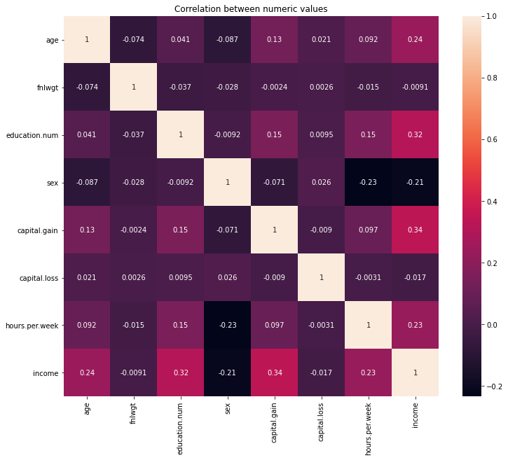
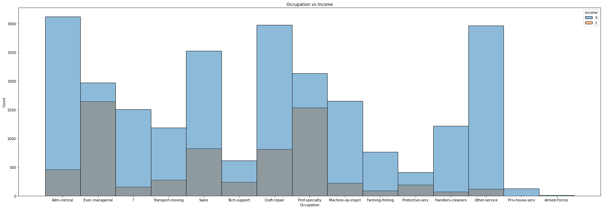
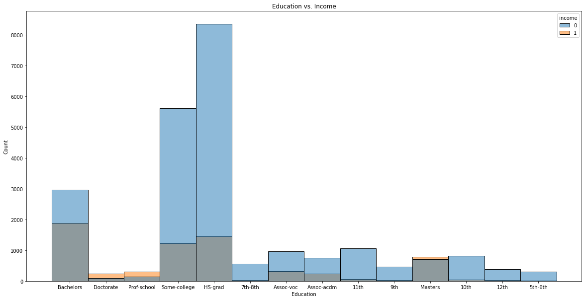
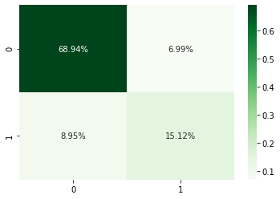

# Adult Salary Classification Project Overview:
* Created a classifer that estimates if an individual's salary is either above or below $50,000 annually with an accuracy rate of 84 percent. 
* Downloaded the data from Kaggle: https://www.kaggle.com/uciml/adult-census-income
* Engineered features by creating dummy variables for the categorical features used in the algorithm and improved the imbalance in the training data since the percentage of indivituals making under $50,000 annually was far exceeding the percentage making over $50,000. 
* Used kfold and cross validation to select the best models. 
* Implemented the best models and evaluated the performance of those models on the test data. 

## Code and Resources 
* Used Google Colab - Python 3.6.9
* Packages: numpy, pandas, sklearn, seaborn, matplotlib
* Dealing with outliers: https://towardsdatascience.com/ways-to-detect-and-remove-the-outliers-404d16608dba
* Encoding vairbales: https://www.analyticsvidhya.com/blog/2020/03/one-hot-encoding-vs-label-encoding-using-scikit-learn/
* Dealing with imbalanced data: https://towardsdatascience.com/methods-for-dealing-with-imbalanced-data-5b761be45a18
* Dummy encoding for multiple categorical variables: https://www.youtube.com/watch?v=6WDFfaYtN6s

## Data Preprocessing 
* Checked for missing values
* Changed the values of the income column from ['<50k', '<=50k', '>50k', '=>50k'] to ['0', '1'] 
* Changed the values of the sex column from ['Female', 'Male'] to ['1', '0']
* Made both of the changed columns into type int
* Created seperate lists for the numeric and categorical features
* Removed any data that had a z score greater than 3

## Data Visulization 
* Used a heatmap to check for correlation between the income and numeric features 

* Created histograms to check for correlation with the hue equal to the income 

## Data Preperation (for the algorithms)
* Used dummy encoding for the 'marital.status' and 'occupation' features 
* I shuffeled the entire dataset before spliting the data into train and test sets. I knew the dataset as a whole was heavily skewed towards an income below 50 thousand, so I decided to oversample the training data and increased the attributes with an income over 50 thousand to 2.6x the number of attrivutes with an income below 50 thousand. I decided to do this because I knew that the test would follow the initial skew, so I wanted to give my models more experience with the over 50 thousand outcome.

## Applying Classification Models
I first used kfold with with 15 splits and shuffling the data. Then I implemented that and cross validation with each of the 4 algorithms that I tested:
* Naive Bayes Cross Validation Accuracy Mean: 82.03 percent
* KNN Cross Validation Accuracy Mean: 72.93 Percent
* Logistic Regression Cross Validation Accuracy Mean: 86.16 percent
* Random Forest Cross Validation Accuracy Mean: 96.61 percent 

## Evaluating Models: 
I decided to evaluate the top two performing models [Random Forest and Logisitic Regression] by testing their F1 scores, accuracy, and creating a confusion matrix for both of them. 

Random forest completely outperformed the logistic regression model in every category. 
* Random Forest Accuracy: 84 percent
* Random Forest F1 Score: 65 percent

